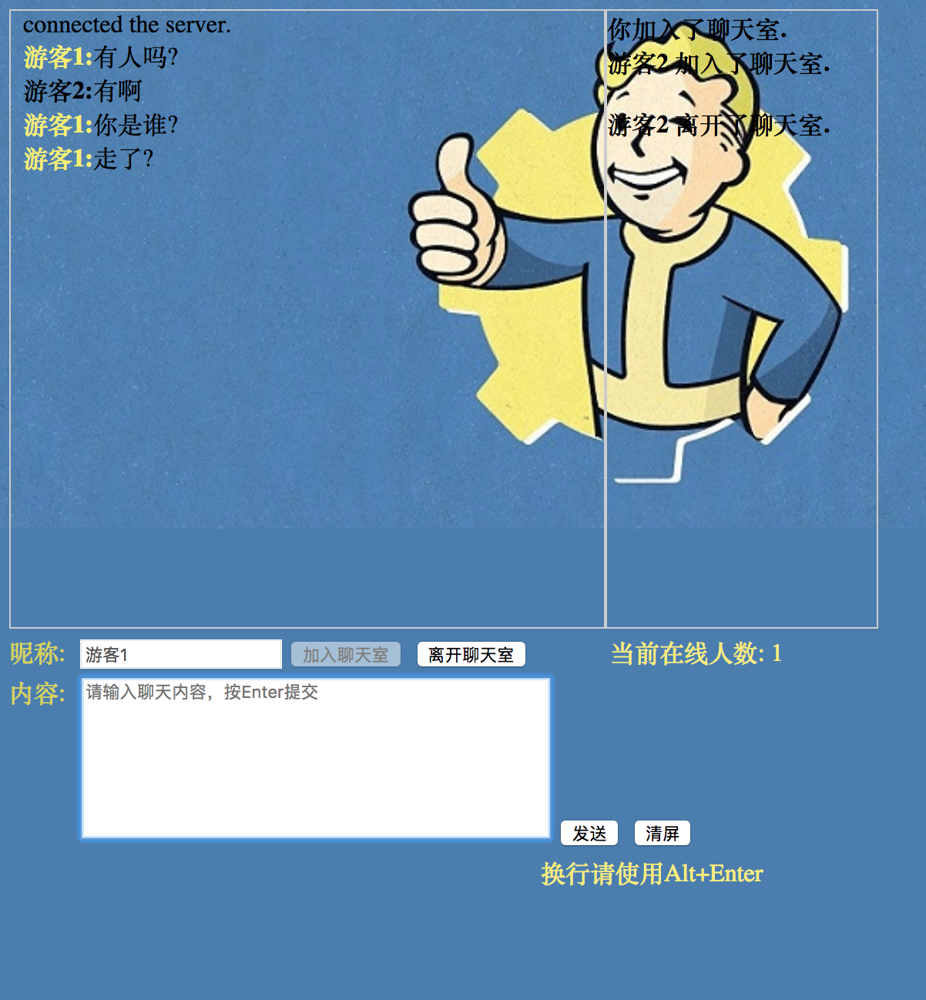

# chat-room
Using Node.js to build a BS application with which multiple ppl can chat in a chat room.

Latest Update:  
Since https://songjiuchongcrs2.herokuapp.com/chat has been **deprecated**, please refer to the final version in branch: 'live', and this app has been deployed to heroku cloud server, and you can visit at :   https://songjiuchongchatroom.herokuapp.com/
  

**Deprecated:** 
In this branch(master), app is set to let visitors visit heroku cloud-hosted server(https://songjiuchongcrs2.herokuapp.com/chat) so they can enter the chatroom.

server1 is sync with https://git.heroku.com/songjiuchongcrs1.git  
server2 is sync with https://git.heroku.com/songjiuchongcrs2.git  

In order to let heroku deploy those two separate but synactic apps on its cloud-nested server:  
https://songjiuchongcrs1.herokuapp.com  
https://songjiuchongcrs2.herokuapp.com  

To sum up, folders: server1 and server2 are two git repo that holding server files(one of them respond to visitor' browser a client-end .html file) for two apps.  

NOTICE:  
1.If you get an error message(failed: Establishing a tunnel via proxy server failed) when entering the chat room, please close any proxy you are using. 
2.You can't look into server1/server2 folders in master branch since those two folders are holding their own git repos, so server1/server2 branches are provided for the sake of let you look inside those two server folders.

**NOTICE: **  
If you get an error message(failed: Establishing a tunnel via proxy server failed) when entering the chat room or simply can't open it, please close any proxy you are using and try again.  

